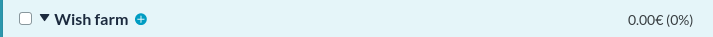

# ynab-percentage-webext

Basic WebExtension to add percentage of your total budget on each on category group inside [YNAB](https://youneedabudget.com/) budget view

## Installation

At the moment, the extension will run only run with some requirements :

- You need to set your Currency number format to `123 456.789` in your YNAB settings.

Install it from the [AMO store](https://addons.mozilla.org/fr/firefox/addon/ynab-percentage-view/) (extension needs to be approved first)

## Usage

- `npm start` will run the extension locally in a temporary Firefox profile.
- `npm start:chrome` will run the extension locally in a temporary Chrome profile.

## Build

- `npm run build`

## Lint

- `npm run lint`

## Release

- Create a tag, release will be created by the [Github Action](.github/workflows/release.yml)

## TODO

- [ ] Find a way to get errors displayed instead of being ignored ([link](https://extensionworkshop.com/documentation/develop/debugging/#debugging-content-scripts))
- [ ] Support multiple number format and configure them
- [ ] Package extension in repository and/or in [AMO](https://addons.mozilla.org/)
- [ ] Chrome extension submission ?
